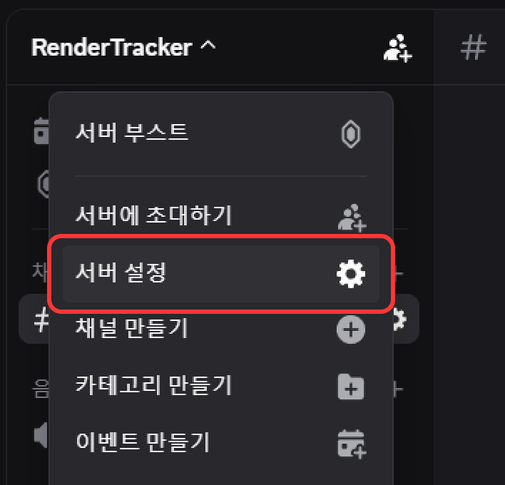
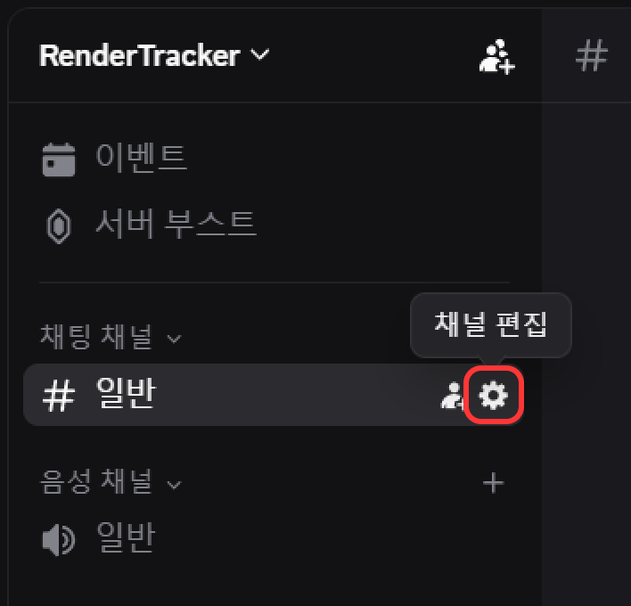
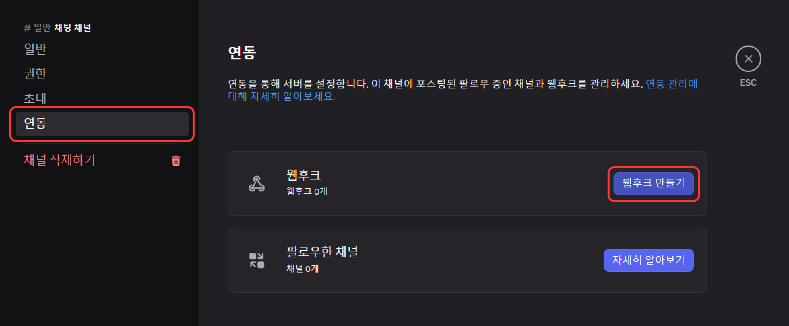
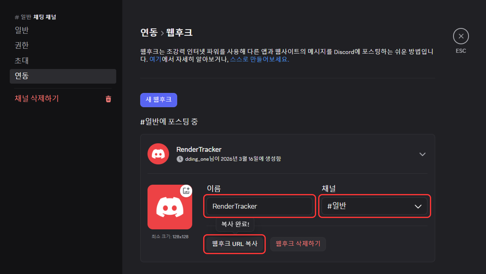

# 디스코드 Webhook 설정 가이드

RenderTracker 알림을 디스코드로 받기 위한 가이드입니다.

---

## 1. 디스코드 Webhook URL 생성

1.  상단 서버 이름을 클릭하여 서버 설정을 클릭합니다. 또는 서버 채널 우측의 톱니바퀴를 클릭합니다.

    
    

 

2.  왼쪽 메뉴에서 **[연동]** 탭을 클릭 후 **[웹후크 만들기]** 버튼을 클릭합니다.

    

 

3.  **[이름]** 과 **[채널]** 을 입력 후 **[웹후크 URL 복사]** 버튼을 클릭하여 복사합니다.
    *   **이름**: Webhook 이름 (예: `RenderTracker`)
    *   **채널**: 알림을 보낼 채널

    

---

## 2. RenderTracker 앱 적용

1.  **디스코드 아이콘 활성화**: 앱 상단의 디스코드 아이콘 활성화(컬러)

2.  **설정 열기**: 앱 우측 상단의 **톱니바퀴 아이콘** 클릭

3.  **주소 입력**: **[디스코드 Webhook]** 섹션의 **[Webhook URL]** 칸에 복사한 주소 붙여넣기 (Ctrl + V)

---

## 3. 알림 확인

*   렌더링 시작 시 디스코드 채널로 작업 정보가 전송됩니다.

*   알림이 오지 않으면 Webhook URL이 올바른지 확인하거나, 앱 상단의 **디스코드 아이콘**이 활성화(컬러) 상태인지 확인하세요.

---

## ⚠️ 주의사항
*   디스코드 특성 상 모바일 알림이 실시간으로 작동하지 않으므로 수동 확인이 필요합니다.

*   컴퓨터에 디스코드가 켜져있으면 모바일에 알림이 오지 않습니다.

*   웹훅 URL이 유출되면 누구나 메시지를 보낼 수 있으니 타인에게 공유하지 마세요.

